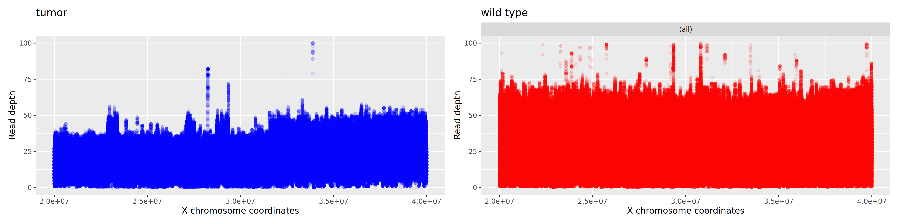
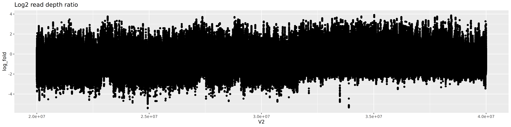

# cancer-genomics-data-analysis-hw2

Cancer Genomics Data Analysis homework

## Task:

In this exercise we want to analyze a cancer genomics sample, namely a paired tumor-normal sample pair. You can download the data set here. The main objective of this exercise is to align the data to the human reference genome (https://hgdownload.soe.ucsc.edu/goldenPath/hg19/bigZips/hg19.fa.gz), to sort and index the alignments and to generate a read-depth plot, as discussed in the lectures. Please note that I downsampled the dataset and I also just kept the data for chromosome X from 20Mbp to 40Mbp (GRCh37/hg19 coordinates) because otherwise all analysis take a lot of time for a human genome. Once you have generated the alignment in BAM format you can subset the BAM to the region of interest using `samtools view -b input.bam chrX:20000000-40000000 > output.bam`.

Please write-up your analysis pipeline using GitHub markdown and use your Github repository to store your analysis scripts in your favorite language, i.e., this could be bash scripts, Snakemake or Nextflow pipelines, R or python scripts. Likewise feel free to check-in a Makefile or a requirements file for Bioconda if you use these to install tools. At the very minimum the repository should contain the produced read-depth plot and a README.md file that explains the steps you have executed to generate the read-depth plot. 

## Conda env setup
The tools for pipeline are specified in environment.yml and are installed using conda.
~~~
conda env create -f environment.yml
conda activate cg_data_analysis_env
~~~

## Run Snakemake pipeline
The pipeline was run on Metacentrum using a profile `profiles/config.yml`

~~~
snakemake --profile profiles/ "$@"
~~~

The pipeline consists of several steps as illustrated in above diagram:
* downloading reads data and uzipping
* downloading reference genome and unzipping
* indexing reference with `bwa index`
* aligning reads with `bwa mem`
* indexing alignment with `samtools index`
* subsetting alignment with `samtools view`
* getting read depth with `samtools depth`
* creating read depth plots using `ggplot2`

## Results:

**Read depth plot for tumor and wild type samples** (points with depth >100 not shown)

**Log2 read depth ratio plot**

